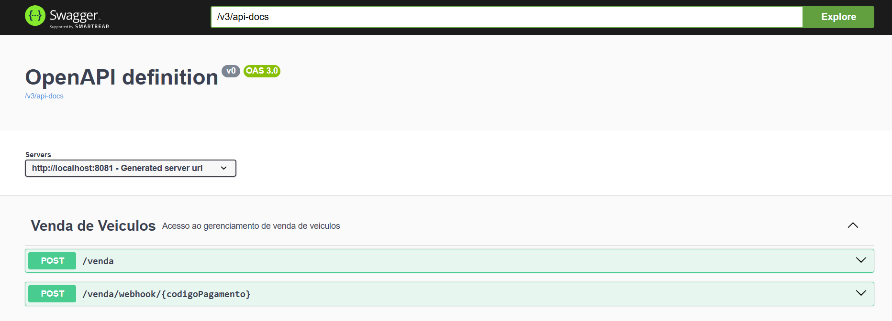
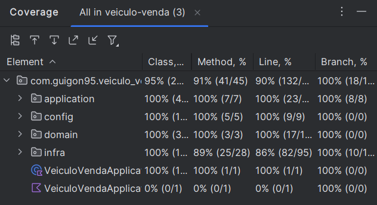

# Veiculo Venda

This project is a sample server for managing vehicles sales, built with Kotlin.

## Description

The Vehicle API allows you to manage vehicle sales information, including generating sales and receiving confirmation in webhook.

## Getting Started

### Prerequisites

- Java 21 or higher

### Installing

1. Clone the repository:
    ```sh
    git clone https://github.com/guigon95/veiculo-venda.git
    cd veiculo-venda
    ```

2. Install dependencies:
    ```sh
    mvn clean install
    ```

### Running the Application

To run the application, use the following command:
```sh
mvn spring-boot:run
```


The server will start on http://localhost:8080.

### API Documentation
The API documentation is available in the docs/swagger.json file. You can use Swagger UI to visualize and interact with the API.


link: http://localhost:8080/swagger-ui/index.html



### Coverage Report



### License
This project is licensed under the Apache 2.0 License - see the LICENSE file for details.